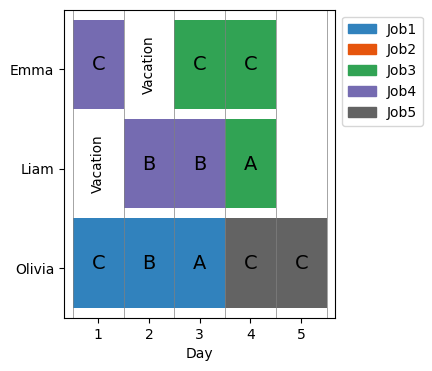
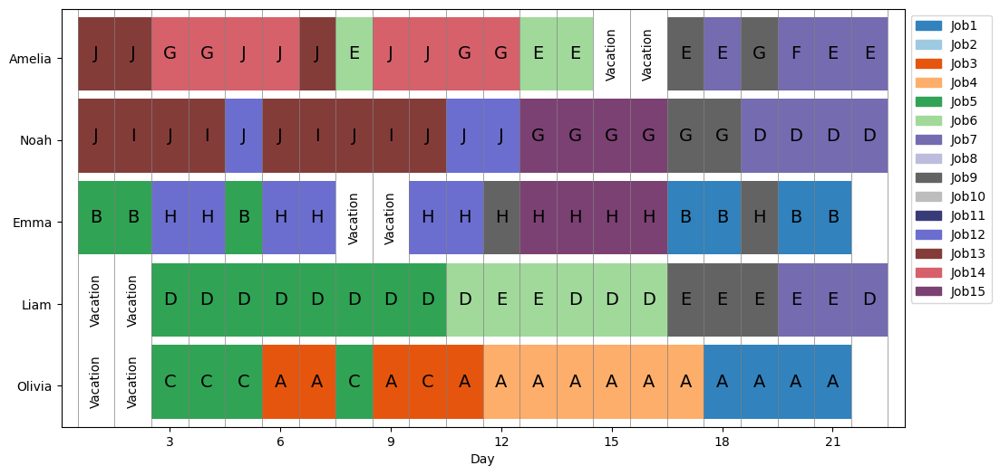
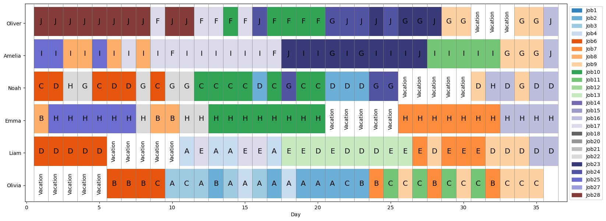
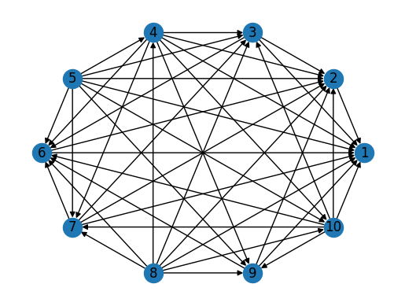

# Bienvenue chez CompuOpti 🤓

## Membres du groupe

- Fernando KURIKE MATSUMOTO
- José Lucas DE MELO COSTA
- Victor Felipe DOMINGUES DO AMARAL

## Fichiers importants

- [Rapport](rapport/specifications.pdf)
- Notebooks :
  - [Optimisation (recherche des solutions)](generate_solutions.ipynb)
  - [Visualisation des solutions](filter_visualize.ipynb)
  - [Modèles de préférence](preference_models.ipynb)

## Résultats

La solution consiste à résoudre un problème d'optimisation en utilisant des techniques de programmation mathématique. On avait trois instance à resoudre : toy, medium et large.

Les solutions non-dominées qui minimisent le $f_1$ (et le $f_2$ dans le cas où il y a plusieurs solutions qui minimisent le $f_1$) sont montrées ci-dessous :

### Instance Toy

### Instance Medium

### Instance Large

### Modèles de préférence

